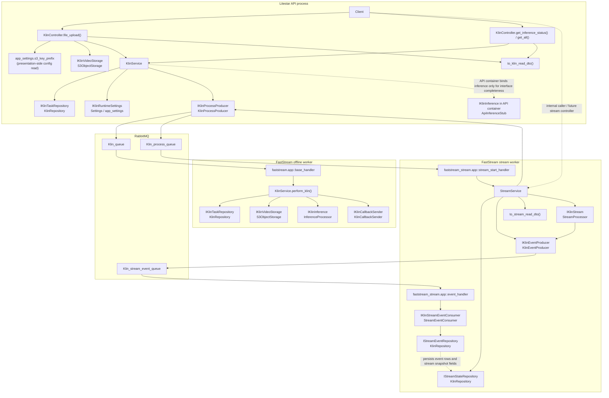

# Full system topology

```mermaid
flowchart TD
    subgraph API["Litestar API process"]
        client["Client"]
        ctrlUpload["KlinController.file_upload()"]
        ctrlRead["KlinController.get_inference_status() / get_all()"]
        apiConfig["app_settings.s3_key_prefix<br/>(presentation-side config read)"]
        apiService["KlinService"]
        apiMapper["to_klin_read_dto()"]
        apiTaskRepo["IKlinTaskRepository<br/>KlinRepository"]
        apiSettings["IKlinRuntimeSettings<br/>Settings / app_settings"]
        apiStorage["IKlinVideoStorage<br/>S3ObjectStorage"]
        apiQueueProducer["IKlinProcessProducer<br/>KlinProcessProducer"]
        apiStub["IKlinInference in API container<br/>ApiInferenceStub"]
    end

    subgraph Rabbit["RabbitMQ"]
        klinQueue["Klin_queue"]
        streamStartQueue["Klin_process_queue"]
        streamEventQueue["Klin_stream_event_queue"]
    end

    subgraph OfflineWorker["FastStream offline worker"]
        klinSubscriber["faststream.app::base_handler"]
        klinPerform["KlinService.perform_klin()"]
        klinRepo["IKlinTaskRepository<br/>KlinRepository"]
        klinInference["IKlinInference<br/>InferenceProcessor"]
        klinCallback["IKlinCallbackSender<br/>KlinCallbackSender"]
        klinStorage["IKlinVideoStorage<br/>S3ObjectStorage"]
    end

    subgraph StreamWorker["FastStream stream worker"]
        streamStartSubscriber["faststream_stream.app::stream_start_handler"]
        streamEventSubscriber["faststream_stream.app::event_handler"]
        streamService["StreamService"]
        streamStateRepo["IStreamStateRepository<br/>KlinRepository"]
        streamEventRepo["IStreamEventRepository<br/>KlinRepository"]
        streamReadMapper["to_stream_read_dto()"]
        streamProcessor["IKlinStream<br/>StreamProcessor"]
        streamEventProducer["IKlinEventProducer<br/>KlinEventProducer"]
        streamEventConsumer["IKlinStreamEventConsumer<br/>StreamEventConsumer"]
    end

    client --> ctrlUpload
    client --> ctrlRead

    ctrlUpload --> apiConfig
    ctrlUpload --> apiStorage
    ctrlUpload --> apiService
    ctrlUpload --> apiMapper
    ctrlRead --> apiService
    ctrlRead --> apiMapper

    apiService --> apiTaskRepo
    apiService --> apiSettings
    apiService --> apiQueueProducer
    apiService -. API container binds inference only for interface completeness .-> apiStub

    apiQueueProducer --> klinQueue
    klinQueue --> klinSubscriber
    klinSubscriber --> klinPerform
    klinPerform --> klinRepo
    klinPerform --> klinStorage
    klinPerform --> klinInference
    klinPerform --> klinCallback

    client -. internal caller / future stream controller .-> streamService
    streamService --> streamStateRepo
    streamService --> apiQueueProducer
    streamService --> streamEventProducer
    streamService --> streamReadMapper
    apiQueueProducer --> streamStartQueue
    streamStartQueue --> streamStartSubscriber
    streamStartSubscriber --> streamService
    streamService --> streamProcessor
    streamProcessor --> streamEventProducer
    streamEventProducer --> streamEventQueue
    streamEventQueue --> streamEventSubscriber
    streamEventSubscriber --> streamEventConsumer
    streamEventConsumer --> streamEventRepo
    streamEventRepo -. persists event rows and stream snapshot fields .-> streamStateRepo
```
