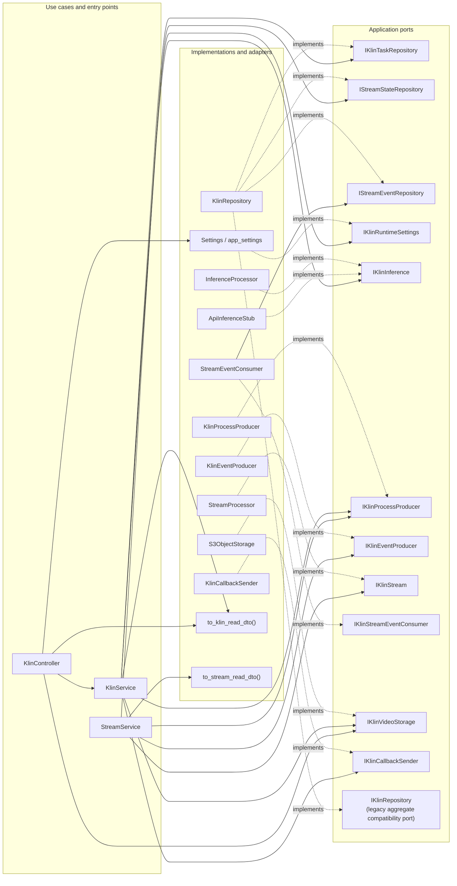

# Interface to implementation map

```mermaid
flowchart LR
    subgraph Ports["Application ports"]
        portTaskRepo["IKlinTaskRepository"]
        portStreamStateRepo["IStreamStateRepository"]
        portStreamEventRepo["IStreamEventRepository"]
        portSettings["IKlinRuntimeSettings"]
        portInference["IKlinInference"]
        portProcessProducer["IKlinProcessProducer"]
        portEventProducer["IKlinEventProducer"]
        portStream["IKlinStream"]
        portConsumer["IKlinStreamEventConsumer"]
        portStorage["IKlinVideoStorage"]
        portCallback["IKlinCallbackSender"]
        portLegacyRepo["IKlinRepository<br/>(legacy aggregate compatibility port)"]
    end

    subgraph Implementations["Implementations and adapters"]
        implRepo["KlinRepository"]
        implInference["InferenceProcessor"]
        implApiStub["ApiInferenceStub"]
        implProcProducer["KlinProcessProducer"]
        implEventProducer["KlinEventProducer"]
        implStream["StreamProcessor"]
        implConsumer["StreamEventConsumer"]
        implStorage["S3ObjectStorage"]
        implCallback["KlinCallbackSender"]
        implSettings["Settings / app_settings"]
        mapKlin["to_klin_read_dto()"]
        mapStream["to_stream_read_dto()"]
    end

    subgraph UseCases["Use cases and entry points"]
        svcKlin["KlinService"]
        svcStream["StreamService"]
        ctrlKlin["KlinController"]
    end

    implRepo -. implements .-> portTaskRepo
    implRepo -. implements .-> portStreamStateRepo
    implRepo -. implements .-> portStreamEventRepo
    implRepo -. implements .-> portLegacyRepo
    implInference -. implements .-> portInference
    implApiStub -. implements .-> portInference
    implProcProducer -. implements .-> portProcessProducer
    implEventProducer -. implements .-> portEventProducer
    implStream -. implements .-> portStream
    implConsumer -. implements .-> portConsumer
    implStorage -. implements .-> portStorage
    implCallback -. implements .-> portCallback
    implSettings -. implements .-> portSettings

    svcKlin --> portTaskRepo
    svcKlin --> portInference
    svcKlin --> portProcessProducer
    svcKlin --> portStorage
    svcKlin --> portCallback
    svcKlin --> portSettings
    svcKlin --> mapKlin

    svcStream --> portStreamStateRepo
    svcStream --> portStream
    svcStream --> portProcessProducer
    svcStream --> portEventProducer
    svcStream --> mapStream

    implConsumer --> portStreamEventRepo

    ctrlKlin --> svcKlin
    ctrlKlin --> portStorage
    ctrlKlin --> implSettings
    ctrlKlin --> mapKlin
```
