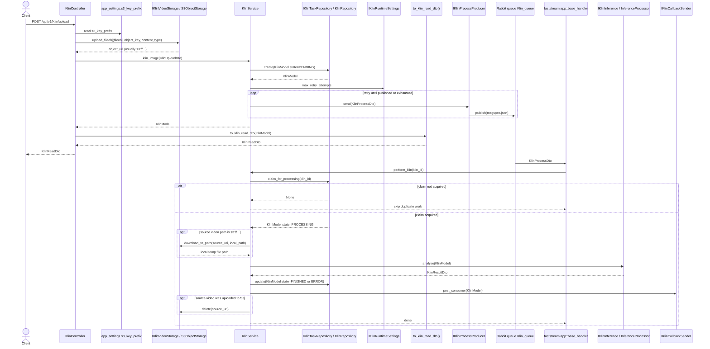

# Offline klin sequence

```mermaid
sequenceDiagram
    actor User as Client
    participant Ctrl as KlinController
    participant Config as app_settings.s3_key_prefix
    participant Storage as IKlinVideoStorage / S3ObjectStorage
    participant Svc as KlinService
    participant Repo as IKlinTaskRepository / KlinRepository
    participant Settings as IKlinRuntimeSettings
    participant Mapper as to_klin_read_dto()
    participant ProcProd as IKlinProcessProducer
    participant Queue as Rabbit queue Klin_queue
    participant Worker as faststream.app::base_handler
    participant Inference as IKlinInference / InferenceProcessor
    participant Callback as IKlinCallbackSender

    User->>Ctrl: POST /api/v1/Klin/upload
    Ctrl->>Config: read s3_key_prefix
    Ctrl->>Storage: upload_fileobj(fileobj, object_key, content_type)
    Storage-->>Ctrl: object_uri (usually s3://...)
    Ctrl->>Svc: klin_image(KlinUploadDto)
    Svc->>Repo: create(KlinModel state=PENDING)
    Repo-->>Svc: KlinModel
    Svc->>Settings: max_retry_attempts
    loop retry until published or exhausted
        Svc->>ProcProd: send(KlinProcessDto)
        ProcProd->>Queue: publish(msgspec.json)
    end
    Svc-->>Ctrl: KlinModel
    Ctrl->>Mapper: to_klin_read_dto(KlinModel)
    Mapper-->>Ctrl: KlinReadDto
    Ctrl-->>User: KlinReadDto

    Queue->>Worker: KlinProcessDto
    Worker->>Svc: perform_klin(klin_id)
    Svc->>Repo: claim_for_processing(klin_id)

    alt claim not acquired
        Repo-->>Svc: None
        Svc-->>Worker: skip duplicate work
    else claim acquired
        Repo-->>Svc: KlinModel state=PROCESSING
        opt source video path is s3://...
            Svc->>Storage: download_to_path(source_uri, local_path)
            Storage-->>Svc: local temp file path
        end

        Svc->>Inference: analyze(KlinModel)
        Inference-->>Svc: KlinResultDto

        Svc->>Repo: update(KlinModel state=FINISHED or ERROR)
        Svc->>Callback: post_consumer(KlinModel)
        opt source video was uploaded to S3
            Svc->>Storage: delete(source_uri)
        end
        Svc-->>Worker: done
    end
```
