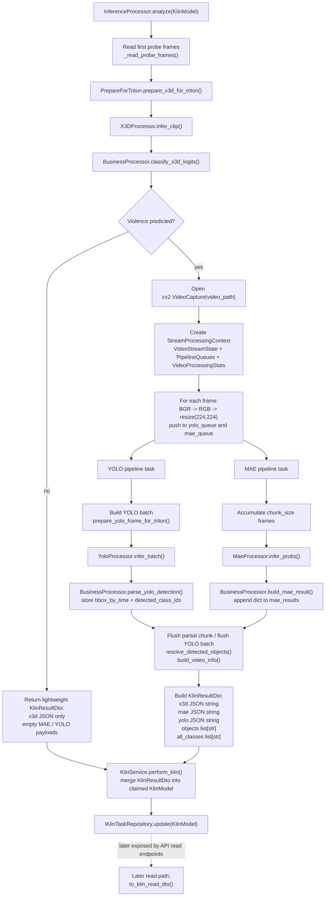

# Internal offline_processor pipeline

```mermaid
flowchart TD
    start["InferenceProcessor.analyze(KlinModel)"]
    probe["Read first probe frames<br/>_read_probe_frames()"]
    x3dPrep["PrepareForTriton.prepare_x3d_for_triton()"]
    x3dInfer["X3DProcessor.infer_clip()"]
    x3dLogic["BusinessProcessor.classify_x3d_logits()"]
    gate{"Violence predicted?"}

    openVideo["Open cv2.VideoCapture(video_path)"]
    ctx["Create StreamProcessingContext<br/>VideoStreamState + PipelineQueues + VideoProcessingStats"]
    readFrames["For each frame:<br/>BGR -> RGB -> resize(224,224)<br/>push to yolo_queue and mae_queue"]

    yoloPipe["YOLO pipeline task"]
    yoloBatch["Build YOLO batch<br/>prepare_yolo_frame_for_triton()"]
    yoloInfer["YoloProcessor.infer_batch()"]
    yoloPost["BusinessProcessor.parse_yolo_detection()<br/>store bbox_by_time + detected_class_ids"]

    maePipe["MAE pipeline task"]
    maeChunk["Accumulate chunk_size frames"]
    maeInfer["MaeProcessor.infer_probs()"]
    maePost["BusinessProcessor.build_mae_result()<br/>append dict to mae_results"]

    finalize["Flush partial chunk / flush YOLO batch<br/>resolve_detected_objects()<br/>build_video_info()"]
    dto["Build KlinResultDto:<br/>x3d JSON string<br/>mae JSON string<br/>yolo JSON string<br/>objects list[str]<br/>all_classes list[str]"]
    fastReturn["Return lightweight KlinResultDto:<br/>x3d JSON only<br/>empty MAE / YOLO payloads"]
    merge["KlinService.perform_klin()<br/>merge KlinResultDto into claimed KlinModel"]
    persist["IKlinTaskRepository.update(KlinModel)"]
    readMap["Later read path:<br/>to_klin_read_dto()"]

    start --> probe --> x3dPrep --> x3dInfer --> x3dLogic --> gate
    gate -- no --> fastReturn
    gate -- yes --> openVideo --> ctx --> readFrames
    readFrames --> yoloPipe --> yoloBatch --> yoloInfer --> yoloPost --> finalize
    readFrames --> maePipe --> maeChunk --> maeInfer --> maePost --> finalize
    finalize --> dto
    fastReturn --> merge
    dto --> merge --> persist
    persist -. later exposed by API read endpoints .-> readMap
```
