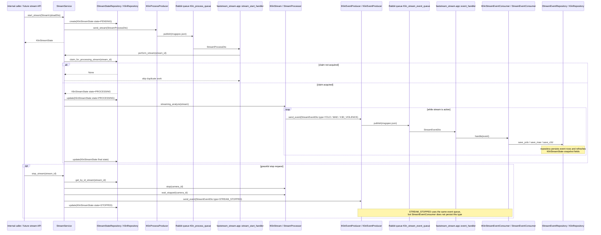

# Streaming sequence

```mermaid
sequenceDiagram
    participant Caller as Internal caller / future stream API
    participant StreamSvc as StreamService
    participant StateRepo as IStreamStateRepository / KlinRepository
    participant ProcProd as IKlinProcessProducer
    participant StartQueue as Rabbit queue Klin_process_queue
    participant StartWorker as faststream_stream.app::stream_start_handler
    participant StreamProc as IKlinStream / StreamProcessor
    participant EventProd as IKlinEventProducer / KlinEventProducer
    participant EventQueue as Rabbit queue Klin_stream_event_queue
    participant EventWorker as faststream_stream.app::event_handler
    participant Consumer as IKlinStreamEventConsumer / StreamEventConsumer
    participant EventRepo as IStreamEventRepository / KlinRepository

    Caller->>StreamSvc: start_stream(StreamUploadDto)
    StreamSvc->>StateRepo: create(KlinStreamState state=PENDING)
    StreamSvc->>ProcProd: send_stream(StreamProcessDto)
    ProcProd->>StartQueue: publish(msgspec.json)
    StreamSvc-->>Caller: KlinStreamState

    StartQueue->>StartWorker: StreamProcessDto
    StartWorker->>StreamSvc: perform_stream(stream_id)
    StreamSvc->>StateRepo: claim_for_processing_stream(stream_id)

    alt claim not acquired
        StateRepo-->>StreamSvc: None
        StreamSvc-->>StartWorker: skip duplicate work
    else claim acquired
        StateRepo-->>StreamSvc: KlinStreamState state=PROCESSING
        StreamSvc->>StateRepo: update(KlinStreamState state=PROCESSING)
        StreamSvc->>StreamProc: streaming_analyze(stream)

        loop while stream is active
            StreamProc->>EventProd: send_event(StreamEventDto type=YOLO / MAE / X3D_VIOLENCE)
            EventProd->>EventQueue: publish(msgspec.json)
            EventQueue->>EventWorker: StreamEventDto
            EventWorker->>Consumer: handle(event)
            Consumer->>EventRepo: save_yolo / save_mae / save_x3d
            Note over EventRepo: repository persists event rows and refreshes<br/>KlinStreamState snapshot fields
        end

        StreamSvc->>StateRepo: update(KlinStreamState final state)
    end

    opt graceful stop request
        Caller->>StreamSvc: stop_stream(stream_id)
        StreamSvc->>StateRepo: get_by_id_stream(stream_id)
        StreamSvc->>StreamProc: stop(camera_id)
        StreamSvc->>StreamProc: wait_stopped(camera_id)
        StreamSvc->>EventProd: send_event(StreamEventDto type=STREAM_STOPPED)
        StreamSvc->>StateRepo: update(KlinStreamState state=STOPPED)
        Note over EventProd,Consumer: STREAM_STOPPED uses the same event queue,<br/>but StreamEventConsumer does not persist this type
    end
```
