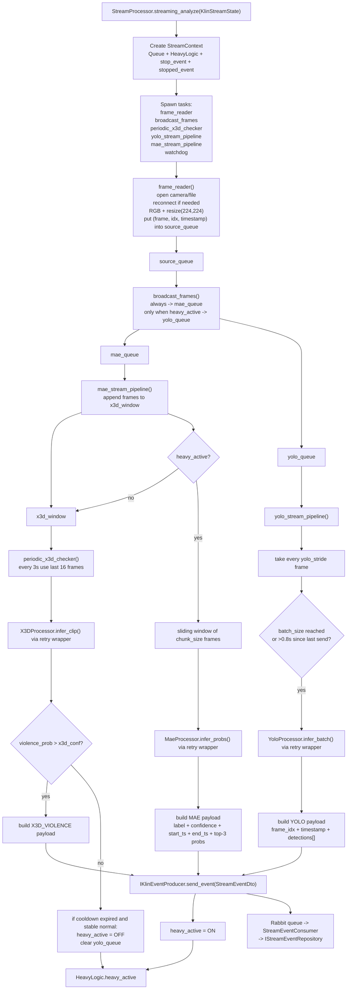

# Internal stream_processor runtime

```mermaid
flowchart TD
    entry["StreamProcessor.streaming_analyze(KlinStreamState)"]
    context["Create StreamContext<br/>Queue + HeavyLogic + stop_event + stopped_event"]
    tasks["Spawn tasks:<br/>frame_reader<br/>broadcast_frames<br/>periodic_x3d_checker<br/>yolo_stream_pipeline<br/>mae_stream_pipeline<br/>watchdog"]

    source["source_queue"]
    maeQ["mae_queue"]
    yoloQ["yolo_queue"]
    x3dWindow["x3d_window"]
    heavy["HeavyLogic.heavy_active"]

    frameReader["frame_reader()<br/>open camera/file<br/>reconnect if needed<br/>RGB + resize(224,224)<br/>put (frame, idx, timestamp) into source_queue"]
    broadcaster["broadcast_frames()<br/>always -> mae_queue<br/>only when heavy_active -> yolo_queue"]

    x3dChecker["periodic_x3d_checker()<br/>every 3s use last 16 frames"]
    x3dInfer["X3DProcessor.infer_clip() via retry wrapper"]
    x3dDecision{"violence_prob > x3d_conf?"}
    x3dEmit["build X3D_VIOLENCE payload"]
    heavyOn["heavy_active = ON"]
    heavyOff["if cooldown expired and stable normal:<br/>heavy_active = OFF<br/>clear yolo_queue"]

    maePipe["mae_stream_pipeline()<br/>append frames to x3d_window"]
    maeGate{"heavy_active?"}
    maeWindow["sliding window of chunk_size frames"]
    maeInfer["MaeProcessor.infer_probs() via retry wrapper"]
    maeEmit["build MAE payload<br/>label + confidence + start_ts + end_ts + top-3 probs"]

    yoloPipe["yolo_stream_pipeline()"]
    yoloStride["take every yolo_stride frame"]
    yoloFlush{"batch_size reached<br/>or >0.8s since last send?"}
    yoloInfer["YoloProcessor.infer_batch() via retry wrapper"]
    yoloEmit["build YOLO payload<br/>frame_idx + timestamp + detections[]"]

    eventOut["IKlinEventProducer.send_event(StreamEventDto)"]
    persistence["Rabbit queue -> StreamEventConsumer<br/>-> IStreamEventRepository"]

    entry --> context --> tasks
    tasks --> frameReader --> source --> broadcaster
    broadcaster --> maeQ --> maePipe --> x3dWindow
    broadcaster --> yoloQ --> yoloPipe

    x3dWindow --> x3dChecker --> x3dInfer --> x3dDecision
    x3dDecision -- yes --> x3dEmit --> eventOut --> heavyOn --> heavy
    x3dDecision -- no --> heavyOff --> heavy

    maePipe --> maeGate
    maeGate -- no --> x3dWindow
    maeGate -- yes --> maeWindow --> maeInfer --> maeEmit --> eventOut

    yoloPipe --> yoloStride --> yoloFlush
    yoloFlush -- yes --> yoloInfer --> yoloEmit --> eventOut

    eventOut --> persistence
```
