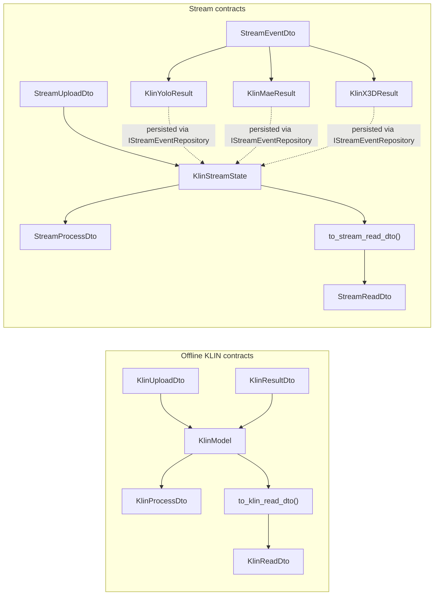

# Data contracts map

```mermaid
flowchart LR
    subgraph OfflineContracts["Offline KLIN contracts"]
        KlinUploadDto["KlinUploadDto"]
        KlinProcessDto["KlinProcessDto"]
        KlinResultDto["KlinResultDto"]
        KlinReadDto["KlinReadDto"]
        KlinModel["KlinModel"]
        KlinMapper["to_klin_read_dto()"]
    end

    subgraph StreamContracts["Stream contracts"]
        StreamUploadDto["StreamUploadDto"]
        StreamProcessDto["StreamProcessDto"]
        StreamEventDto["StreamEventDto"]
        StreamReadDto["StreamReadDto"]
        KlinStreamState["KlinStreamState"]
        StreamMapper["to_stream_read_dto()"]
        KlinYoloResult["KlinYoloResult"]
        KlinMaeResult["KlinMaeResult"]
        KlinX3DResult["KlinX3DResult"]
    end

    KlinUploadDto --> KlinModel
    KlinModel --> KlinProcessDto
    KlinResultDto --> KlinModel
    KlinModel --> KlinMapper --> KlinReadDto

    StreamUploadDto --> KlinStreamState
    KlinStreamState --> StreamProcessDto
    KlinStreamState --> StreamMapper --> StreamReadDto

    StreamEventDto --> KlinYoloResult
    StreamEventDto --> KlinMaeResult
    StreamEventDto --> KlinX3DResult

    KlinYoloResult -. persisted via IStreamEventRepository .-> KlinStreamState
    KlinMaeResult -. persisted via IStreamEventRepository .-> KlinStreamState
    KlinX3DResult -. persisted via IStreamEventRepository .-> KlinStreamState
```
