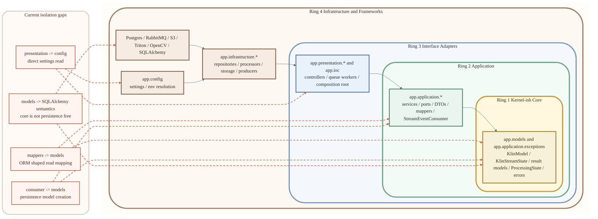

# Clean Architecture Isolation View

## Reading This Diagram

- Solid arrows show the intended inward dependency direction: outer layers depend on inner layers.
- Dashed arrows show the places where the current code still leaks persistence or framework concerns across layers.
- This view is intentionally compressed into one block per ring. Use the other flowcharts for DTO-level and processor-level detail.

## Isolation Verdict

### Stronger parts

- `KlinService` no longer imports `app_settings` directly; retry settings now come through `IKlinRuntimeSettings`.
- `app.application.dto` is cleaner: read DTOs no longer contain `from_model()` / `from_stream_state()` methods.
- Repository responsibilities are clearer after splitting the active ports into `IKlinTaskRepository`, `IStreamStateRepository`, and `IStreamEventRepository`.
- `app.ioc` still acts as a clean composition root at the edge.

### Weaker parts

- `app.models` are still SQLAlchemy ORM entities, so the innermost layer is not a pure domain kernel.
- `app.application.mappers` still reads ORM models directly, so the read side is cleaner than before, but not persistence-independent.
- `StreamEventConsumer` still constructs persistence-oriented models like `KlinMaeResult` and `KlinYoloResult` directly.
- `KlinController._build_object_key()` still reads `app_settings` directly in the presentation layer.

## Short Conclusion

The project is now closer to a disciplined ports-and-adapters structure than before, but it is still not a strict clean architecture.

The most useful next steps from here would be:

- replace ORM entities in inner layers with pure domain entities
- introduce typed stream event payloads instead of `type: str` + `payload: dict`
- move controller-side config reads behind small injected ports
- stop constructing persistence models directly inside the application consumer
